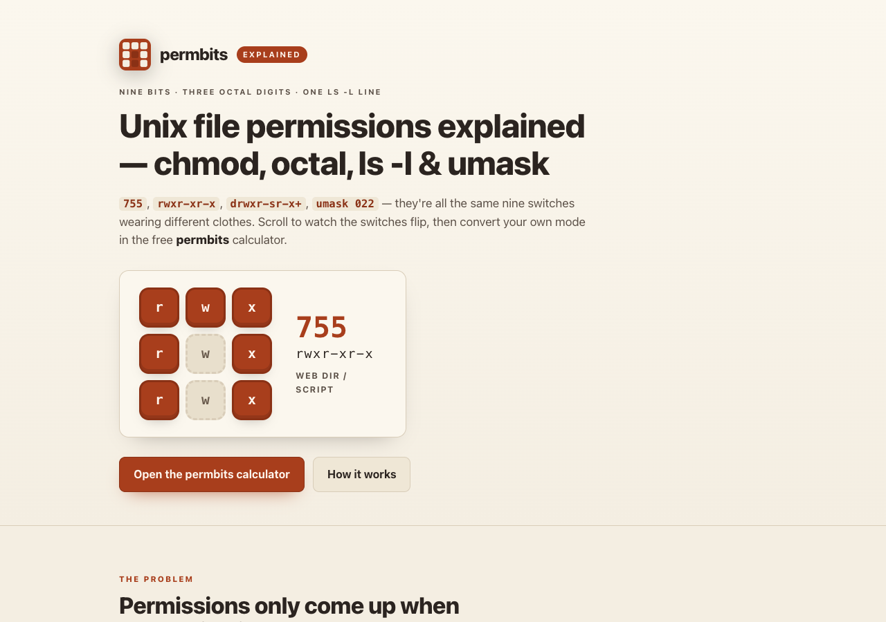

# permbits — explained

**Unix file permissions explained — chmod, octal, ls -l & umask, with animation.** A single-page, scroll-driven explainer that shows how the nine `rwx` switches become octal modes like `755`, how to pull an `ls -l` mode field apart character by character (type char, setgid `s`, the `+` ACL marker), how umask arithmetic sets your defaults, and how the SSH `UNPROTECTED PRIVATE KEY FILE` error is fixed with two switches. 100% client-side, zero dependencies, fully offline, tells no one what you're reading about.

**Try the calculator this explains → [permbits](https://sreenivas-sadhu-prabhakara.github.io/permbits/)**

## Why

Nobody meets file permissions on a good day. They show up when a deploy script won't run, a web server throws 403, or SSH refuses the key you've used for months — and the answer comes back in a code (`0644`, `rwxr-xr-x`, `drwxr-sr-x+`) that only helps if you can already read it. The top search result is usually `chmod 777`, which "fixes" the error by handing write access to everyone.

This page is the picture that makes the code readable. It's the companion explainer to **permbits**, the free offline chmod calculator that converts any representation of a mode into every other one, with 24 cited recipes for the situations people actually search.

## What's on the page

A short animated narrative, scene by scene:

1. **The hook** — a live 3×3 bit grid cycling through `755` → `644` → `600` → `700` with its octal and symbolic readouts.
2. **The problem** — the real OpenSSH `UNPROTECTED PRIVATE KEY FILE` warning, and why `chmod 777` is the wrong reflex.
3. **The core idea** — nine switches; each row of three, weighted 4·2·1, is one octal digit. `111 101 101` → `755`.
4. **ls -l anatomy** — `drwxr-sr-x+` pulled apart: type char, owner/group/others triads, the setgid `s`, and the trailing `+` ACL marker (recognised, explained, never silently dropped).
5. **The fix** — `644 → 600` animated on the grid, with the cited `chmod 600` recipe.
6. **umask** — the withheld-bits arithmetic: files `666 & ~022 = 644`, directories `777 & ~022 = 755`.
7. **The privacy guarantee** — a diagram of `connect-src 'none'`: the page *cannot* phone home, so a pasted production `ls -l` line cannot leave your device.
8. **A short feature tour** of permbits, and a call to action to open it.

## Design & accessibility

- **Animation is pure CSS + inline SVG** driven by `IntersectionObserver` — no libraries, nothing loaded from a CDN, CSP-clean.
- **`prefers-reduced-motion` is respected**: every animation degrades to a static, fully legible final state (the hero grid freezes on `755`; the fix grid shows the finished `600`).
- **WCAG-AA in both light and dark**; bit state is never colour-only (ON = solid filled cell, OFF = dashed hollow cell, with the letter in both); keyboard-operable with visible focus rings and a skip-link; every animated diagram has a text alternative.
- **No serif display fonts** — the system sans stack, mono for modes, tabular figures, and one motif (the 3×3 permission bit grid) carried through the page, the OG card and the icon — the same rust-on-oatmeal family as the permbits app (this explainer wears the inverted icon: oat cells on rust).

## Quickstart

Just open `index.html` in any modern browser — no build step, no server, no install.

- **Local:** double-click `index.html`, or run a static server in the folder.
- **Hosted:** this explainer is live on GitHub Pages; the calculator it explains is at **[permbits](https://sreenivas-sadhu-prabhakara.github.io/permbits/)**.

## Privacy

This is a static page built so it *cannot* leak anything.

- A strict Content-Security-Policy sets `connect-src 'none'`: the page **cannot** make any network request. No fonts, scripts, images or analytics are loaded from anywhere else — everything is same-origin.
- This page stores nothing at all. The linked permbits calculator keeps only your last mode, theme and recent recipes in your own browser's localStorage.

## Disclaimer

permbits — explained is **an explainer, not a substitute for your system's documentation.** It covers the classic POSIX permission model; ACLs (beyond recognising the `+` marker), SELinux/AppArmor contexts, capabilities and Windows permissions are out of scope, and distributions can differ in their packaged defaults. Neither this page nor permbits reads or changes real files — you run any command yourself, so check `man chmod` and your distribution's documentation before changing permissions on system files: a wrong mode on the wrong file can lock you out or open a security hole. Recipe citations and their verified-on dates live in the permbits app. This software is provided under the MIT License, "as is", without warranty of any kind; the author accepts no liability for any loss arising from its use.

## License

[MIT](./LICENSE) © 2026 Sreenivas Sadhu Prabhakara
